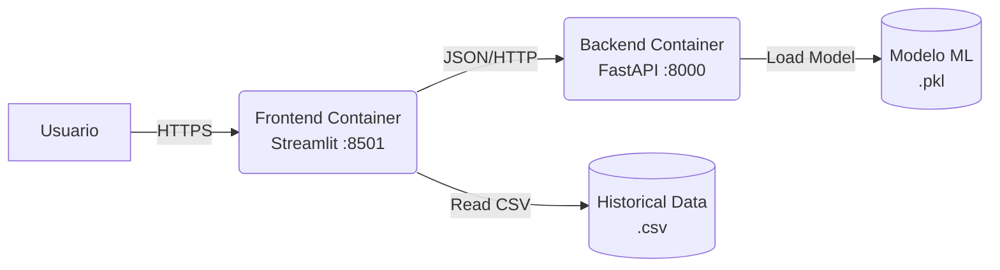

# ATP Match Predictor AI🎾

> Sistema Full Stack de Inteligencia Artificial para la predicción de resultados deportivos basado en arquitecturas de microservicios.


---

## Demo en Vivo

Puedes probar la aplicación desplegada en la nube aquí:

**Acceder a ATP Match Predictor (Frontend)**: https://atp-predictor-web.onrender.com

(Nota: Al estar alojado en una instancia gratuita, el servidor puede tardar unos 30-50 segundos en activarse si lleva tiempo inactivo.)

---

## Descripción del Proyecto

ATP Match Predictor es una solución completa de ingeniería de software que convierte un análisis de datos estático en un producto digital escalable y desplegable en la nube.

El sistema ingiere datos históricos de la ATP desde 2015, procesa sus estadísticas y entrena un modelo de Machine Learning capaz de estimar la probabilidad de victoria entre dos jugadores según sus estadísticas y la superficie del partido.

### Características Principales

- Microservicios independientes (Frontend + Backend)
- Arquitectura reproducible mediante Docker Compose
- Interfaz moderna con Streamlit (estilo Glassmorphism)
- API REST con FastAPI y validación por Pydantic
- Pipeline ETL para limpiar y transformar datos históricos

---

## Arquitectura Técnica



Capa de Datos: datos procesados para mitigar Concept Drift (post-2015).

Capa de ML: modelo RandomForestClassifier optimizado para datos tabulares.

Backend: expone el modelo mediante API y gestiona validaciones.

Frontend: consume la API y muestra visualizaciones interactivas.

---

## Ciencia de Datos y Machine Learning

### El Desafío
Predecir resultados de tenis es complejo debido a la varianza humana y factores externos. Un modelo aleatorio tendría 50% de acierto.

### La Solución
Se entrenó un modelo Random Forest debido a su robustez frente al overfitting en datos tabulares.

### Variables Predictoras

- diff_rank: diferencia de ranking entre jugadores
- diff_pts: diferencia de puntos ATP
- surface: codificación One-Hot de superficie (Hard, Clay, Grass)

### Métricas

- Accuracy Global: ~60%
- Ingeniería de características basada en diferenciales numéricos

---

## Instalación y Ejecución (Local)

### Pre-requisitos

- Docker Desktop
- Git

### Opción A: Despliegue con Docker (Recomendado)

```bash
# 1. Clonar el repositorio
git clone https://github.com/raulJD13/atp-match-predictor.git
cd atp-match-predictor

# 2. Construir y arrancar los contenedores
docker-compose up --build
```

Acceso local:

- Web App: http://localhost:8501
- Documentación API: http://localhost:8000/docs

### Opción B: Ejecución Manual

#### Backend

```bash
cd backend
python -m venv venv
source venv/bin/activate
pip install -r requirements.txt
uvicorn app.main:app --reload
```

#### Frontend (otra terminal)

```bash
cd frontend
python -m venv venv
source venv/bin/activate
pip install -r requirements.txt
streamlit run app.py
```

---

## Estructura del Proyecto

```
atp-match-predictor/
├── docker-compose.yml
├── README.md
├── backend/
│   ├── Dockerfile
│   ├── requirements.txt
│   ├── app/
│   │   ├── main.py
│   │   └── ...
│   └── models/
│       └── modelo_atp_rf.pkl
└── frontend/
    ├── Dockerfile
    ├── requirements.txt
    ├── app.py
    └── data/
        └── atp_matches.csv
```

---

## Documentación de la API

### Endpoint: POST /predict

Ejemplo de Request:

```json
{
  "diff_rank": -10,
  "diff_pts": 500,
  "surface": "Clay"
}
```

Ejemplo de Response:

```json
{
  "winner": "Player 1",
  "probability_player_1": 0.65,
  "input_received": { }
}
```

---

## Futuras Mejoras (Roadmap)

- [ ] Integración de API deportiva en tiempo real
- [ ] Mejora del modelo (XGBoost, rachas, H2H)
- [ ] Migración a base de datos PostgreSQL
- [ ] CI/CD con GitHub Actions

---

## Autor

Raúl Jiménez - Full Stack Developer & AI Enthusiast

Proyecto desarrollado como parte del portafolio profesional en Machine Learning Engineering.

